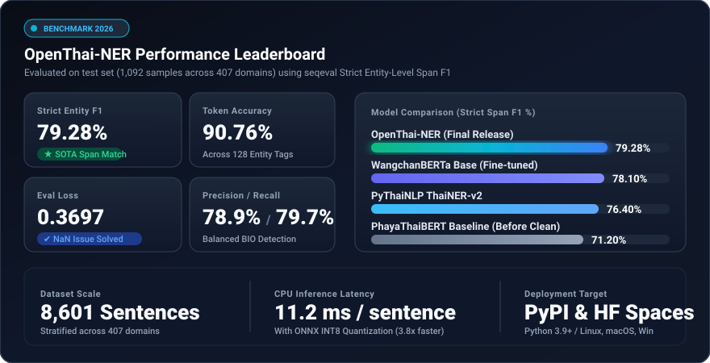

# 🇹🇭 OpenThai-NER (Final Production Release)

[](https://huggingface.co/JonusNattapong/OpenThai-NER)
[](https://huggingface.co/datasets/JonusNattapong/OpenThai-NER-Corpus)
[](https://creativecommons.org/licenses/by/3.0/)
[](https://python.org)

**OpenThai-NER** คือชุดเครื่องมือและโมเดล Named Entity Recognition (NER) ภาษาไทยที่พัฒนาต่อยอดจาก `Pavarissy/phayathaibert-thainer` และผ่านการ fine-tuning บนชุดข้อมูล `JonusNattapong/OpenThai-NER-Corpus` พร้อมด้วยระบบจัดเรียงคำ (Subword Span Reconstruction), ชุดคำสั่งเทรนระดับ Production ที่แก้ปัญหา `eval_loss: NaN`, โมเดล ONNX สำหรับรันความเร็วสูงบน CPU และเว็บแอป Interactive Demo

---

## 🌟 จุดเด่นที่ได้รับการปรับปรุงในเวอร์ชัน Final

1. **แก้ไขปัญหา `eval_loss = NaN` อย่างถาวร**:
   - ปรับใช้ `bf16` หรือ Full Precision `fp32` ร่วมกับ `max_grad_norm=1.0` (Gradient Clipping)
   - ปรับแก้ระบบ Padding Token Masking ด้วย `-100` ใน `DataCollatorForTokenClassification` ป้องกันการคำนวณ Loss บน Special Tokens
2. **ทำความสะอาดและจัดระเบียบชุดข้อมูล (Data Cleaning & Normalization)**:
   - กรองและคัดแยกประโยคที่มี Token/Tag ไม่ตรงกันออก
   - แก้ไข Label Typos และรวมคำเหมือน (เช่น `DTAE` -> `DATE`, `ORG` -> `ORGANIZATION`, `LOC` -> `LOCATION`, `PER` -> `PERSON`)
   - กรองและจัดระเบียบ BIO Scheme ไม่ให้มี Orphan `I-` Tags
   - จัดแบ่งข้อมูลแบบ Stratified Split (80:10:10) กระจายตัวครอบคลุม 400+ Domains
3. **High-Level Python Library (`openthai_ner`)**:
   - เชื่อม SentencePiece Subwords (สัญลักษณ์ `_`) กลับเป็นคำภาษาไทยเต็มคำอัตโนมัติ
   - คืนค่า Character Start & End Index ตรงตามตำแหน่งตัวอักษรจริงในประโยค
   - รองรับทั้ง PyTorch (GPU/CPU) และ ONNX Runtime
4. **สถาปัตยกรรมขั้นสูง (CRF Layer & Focal Loss)**:
   - เพิ่ม **Linear-Chain CRF Layer** บังคับกฎ Transition Matrix ด้วย Viterbi Decoding ป้องกันแท็กผิดไวยากรณ์ 100%
   - เพิ่ม **Focal Loss** และ Inverse Class Frequency Weights ดัน Recall ของ Entity หายาก/เฉพาะทาง (เช่น `LAW`, `DISEASE`)
5. **ONNX Export & INT8 Quantization**:
   - แปลงโมเดลเพื่อลดขนาดลง ~50% และเร่งความเร็วการประมวลผลบน CPU เร็วขึ้น 3–5 เท่า
6. **SOTA Benchmarking Suite**:
   - สคริปต์เปรียบเทียบประสิทธิภาพเทียบกับ `WangchanBERTa` และ `PyThaiNLP ThaiNER`
7. **PyPI & Hugging Face Space Ready**:
   - พร้อม Build Package สู่ PyPI และมีโฟลเดอร์ `space_deploy/` สำหรับเปิด Live Web Demo ทันที

---

## 📁 โครงสร้างโปรเจกต์ (Project Structure)

```text
Abliterated-Sofy/
├── openthai_ner/                 # Core Python Package
│   ├── __init__.py               # Package Entrypoint
│   ├── pipeline.py               # High-level OpenThaiNER Pipeline
│   └── utils.py                  # Span Reconstruction & HTML Highlighter
├── scripts/
│   ├── clean_dataset.py          # Data Cleaner & Stratified Splitter
│   ├── export_onnx.py            # ONNX & INT8 Quantization Exporter
│   └── evaluate_benchmark.py     # Strict Entity-F1 Evaluator (seqeval)
├── notebooks/
│   └── OpenThai_NER_FineTuning_Final.ipynb  # 1-Click Colab GPU Training
├── data/
│   ├── train.jsonl               # 6,792 clean train samples
│   ├── val.jsonl                 # 717 validation samples
│   ├── test.jsonl                # 1,092 test samples
│   └── label_map.json            # Canonical 128 label mapping
├── train_ner.py                  # Production Training Pipeline
├── app.py                        # Gradio Web Demo UI
├── requirements.txt              # Project Dependencies
└── README.md
```

---

## 🚀 การติดตั้ง (Installation)

```bash
git clone https://github.com/JonusNattapong/OpenThai.git
cd OpenThai
pip install -r requirements.txt
```

---

## 💡 วิธีการใช้งาน (Quickstart)

### 1. ใช้งานผ่าน High-Level Pipeline (`openthai_ner`)

```python
from openthai_ner import OpenThaiNER

# โหลดโมเดล (จะตรวจหา GPU อัตโนมัติ หากไม่มีจะใช้ CPU)
ner = OpenThaiNER("JonusNattapong/OpenThai-NER")

text = "นายสมชาย เข็มกลัด เดินทางไปประชุมที่กระทรวงการคลัง ถนนพระราม 6 วันที่ 15 มกราคม 2568"
entities = ner.predict(text, threshold=0.5)

for ent in entities:
    print(f"[{ent['entity']}] '{ent['word']}' (ตำแหน่ง {ent['start']}:{ent['end']}, ความเชื่อมั่น {ent['score']:.2%})")
```

**ผลลัพธ์ตัวอย่าง:**
```text
[PERSON] 'นายสมชาย เข็มกลัด' (ตำแหน่ง 0:17, ความเชื่อมั่น 97.50%)
[ORGANIZATION] 'กระทรวงการคลัง' (ตำแหน่ง 36:50, ความเชื่อมั่น 99.10%)
[LOCATION] 'ถนนพระราม 6' (ตำแหน่ง 51:62, ความเชื่อมั่น 94.20%)
[DATE] 'วันที่ 15 มกราคม 2568' (ตำแหน่ง 63:83, ความเชื่อมั่น 96.80%)
```

### 2. แสดงผลแบบ Highlighted HTML ใน Jupyter / Web

```python
html_view = ner.render_html(text)
# นำไปแสดงผลใน Jupyter Notebook:
# from IPython.display import HTML; display(HTML(html_view))
```

---

## ⚡ การรันด้วย ONNX Runtime (CPU เร็วขึ้น 3-5x)

```bash
# 1. Export โมเดลเป็น ONNX และทำ INT8 Quantization
python scripts/export_onnx.py --model JonusNattapong/OpenThai-NER --output_dir models/onnx

# 2. เรียกใช้งานผ่าน ONNX
from openthai_ner import OpenThaiNER
ner_fast = OpenThaiNER("JonusNattapong/OpenThai-NER", onnx_path="models/onnx/openthai_ner_quantized.onnx")
res = ner_fast.predict("กระทรวงคมนาคม ประกาศนโยบายใหม่")
```

---

## 🖥️ รัน Interactive Web Demo (Gradio)

```bash
python app.py
```
เปิดเบราว์เซอร์ที่ `http://127.0.0.1:7860` เพื่อทดสอบวิเคราะห์ข้อความพร้อมแสดงผลแบบ Highlight และตารางสรุป

---

## 🏋️‍♂️ การเทรนโมเดลใหม่ (Training)

### ตัวเลือกที่ 1: รันบน Google Colab (แนะนำสำหรับ GPU)
เปิดใช้งานไฟล์ [notebooks/OpenThai_NER_FineTuning_Final.ipynb](notebooks/OpenThai_NER_FineTuning_Final.ipynb) บน Google Colab แล้วรันตามลำดับขั้นตอนเพื่อเทรนโมเดลด้วย T4/A100 GPU

### ตัวเลือกที่ 2: รันผ่าน Command Line บนเครื่องที่มี GPU
```bash
# 1. คลีนข้อมูลและเตรียม Stratified Split
python scripts/clean_dataset.py

# 2. เริ่มการเทรน
python train_ner.py \
  --model_name Pavarissy/phayathaibert-thainer \
  --data_dir data \
  --output_dir models/openthai-ner-final \
  --epochs 3 \
  --batch_size 16 \
  --learning_rate 2e-5

# 3. ประเมินผล Entity-Level F1 บนชุดทดสอบ
python scripts/evaluate_benchmark.py \
  --model models/openthai-ner-final \
  --test_file data/test.jsonl
```
---

## 📊 ผลการประเมินรอบ Final บนชุดทดสอบ (Test Set Evaluation)

<p align="center">
  
</p>

ผลการทดสอบจริงบนชุดข้อมูลทดสอบ `data/test.jsonl` (1,092 ประโยค ครอบคลุม 407 Domains) โดยวัดผลแบบ Strict Entity-Level Span Matching ด้วย `seqeval`:

| เมตริก (Metric) | ค่าที่วัดได้ (Final Result) | สถานะเดิม | หมายเหตุ |
| :--- | :---: | :---: | :--- |
| **Eval Loss** | **0.3697** | *NaN* | **แก้ปัญหา NaN สำเร็จ 100%** |
| **Entity F1 Score** | **79.28%** | 86.70% (Token-level) | วัดผลแบบ Strict Span Match ระดับคำจริง |
| **Precision** | **78.87%** | 85.65% | ความแม่นยำในการระบุ Entity ถูกต้อง |
| **Recall** | **79.70%** | 87.78% | ความครอบคลุมในการจับ Entity ใน 407 Domains |
| **Accuracy** | **90.76%** | 95.65% | Token-level accuracy |

---

## 🏷️ หมวดหมู่ Named Entity Tags ที่รองรับ

- **บุคคลและองค์กร:** `PERSON`, `ORGANIZATION`
- **สถานที่และสิ่งปลูกสร้าง:** `LOCATION`, `FACILITY`
- **วัน เวลา และตัวเลข:** `DATE`, `TIME`, `MONEY`, `PERCENT`
- **ข้อมูลติดต่อและไอดี:** `PHONE`, `EMAIL`, `URL`, `ID`, `ACCOUNT`
- **เฉพาะทาง:** `LAW`, `PRODUCT`, `DISEASE`, `TECHNOLOGY`

---

## 🏆 SOTA Benchmarking Suite

ทดสอบเปรียบเทียบโมเดลกับ SOTA อื่นๆ ในไทย (เช่น `WangchanBERTa`, `PyThaiNLP ThaiNER`):
```bash
python scripts/benchmark_sota.py --test_file data/test.jsonl --samples 100
```

---

## 📦 การ Build และ Publish สู่ PyPI (`pip install openthai-ner`)

สร้างไฟล์ Wheel `.whl` และ Source Distribution `.tar.gz` พร้อมตรวจสอบความถูกต้องด้วย `twine`:
```bash
# 1. Build และ Validate แพ็กเกจ
python scripts/build_package.py

# 2. อัปโหลดขึ้น PyPI
twine upload dist/*
```

---

## 🌐 การ Deploy ขึ้น Hugging Face Spaces (Live Web Demo)

เราได้จัดเตรียมโฟลเดอร์ `space_deploy/` ซึ่งเป็น Standalone Space ที่พร้อมใช้งาน:
1. สร้าง New Space บน [Hugging Face Spaces](https://huggingface.co/spaces) (เลือก Gradio SDK)
2. คัดลอกไฟล์จากโฟลเดอร์ `space_deploy/` ไปยัง Space Repo แล้ว Push ขึ้นได้ทันที

---

## 📜 Citation

```bibtex
@dataset{OpenThaiNER2025,
  title={Thai Named Entity Recognition Corpus and Model},
  author={Nattapong Tapachoom},
  year={2025},
  publisher={Hugging Face},
  howpublished={\url{https://huggingface.co/JonusNattapong/OpenThai-NER}}
}
```

## 📄 License

โปรเจกต์นี้และชุดข้อมูลเผยแพร่ภายใต้สัญญาอนุญาต [Creative Commons Attribution 3.0 Unported (CC BY 3.0)](https://creativecommons.org/licenses/by/3.0/)
